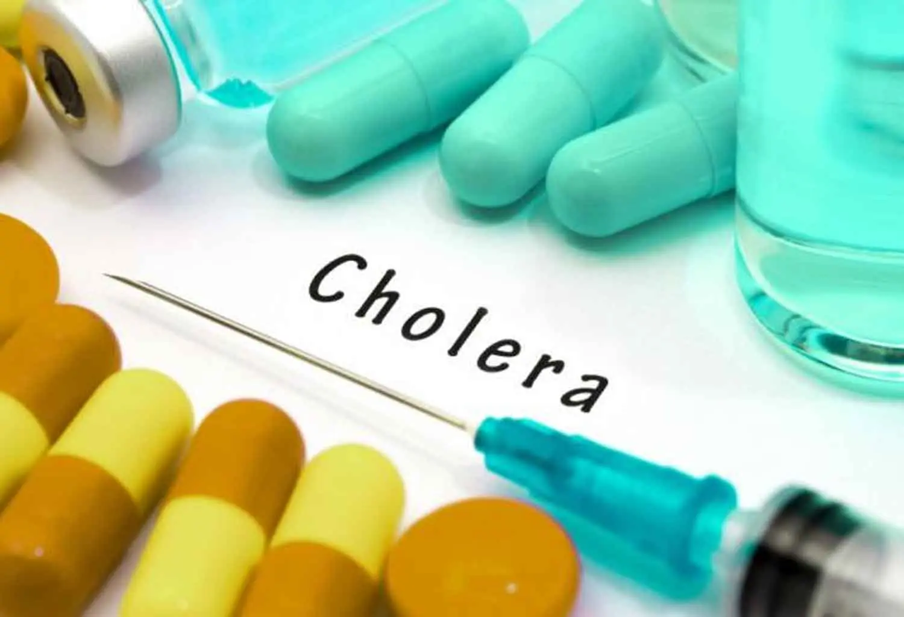
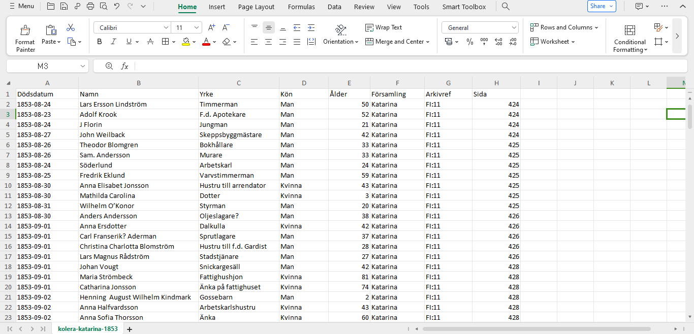
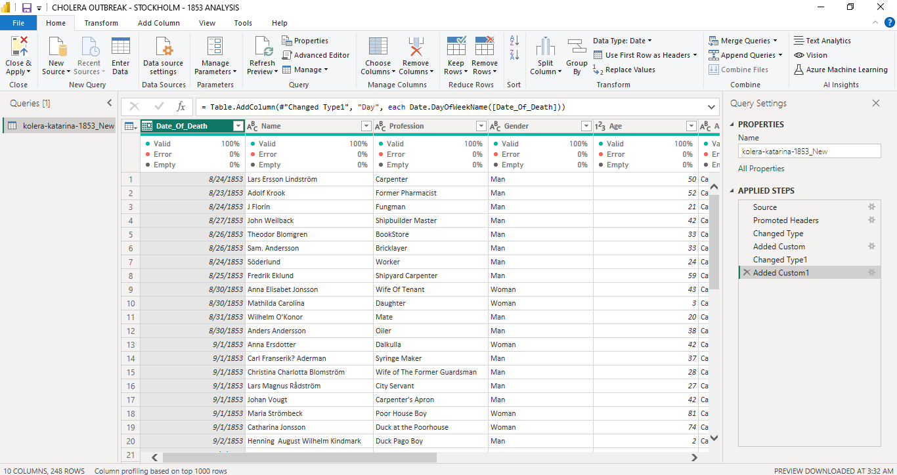
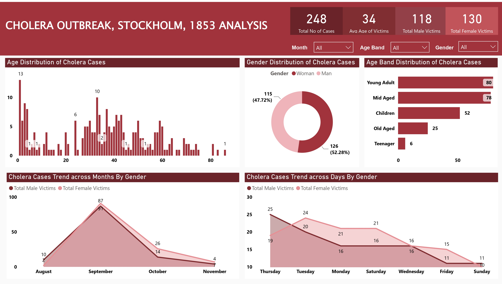

# Cholera-Outbreak-Stockholm-1853-Analysis

## Table of Contents
- [Project Overview](#project-overview)
- [About The Dataset](#about-the-dataset)
- [Tools Used](#tools-used)
- [Visuals in Power BI:](#visuals-in-power-bi)
- [Interact With Power BI Dashboard Report](#interact-with-power-bi-dashboard-report)
- [Conclusion](#conclusion)

## Project Overview
### Introduction:
The cholera outbreak of 1853 in Stockholm, Sweden, colloquially known as "Kolera Katerina," represents a crucial moment in the city's history, where the convergence of urbanization and public health crises laid bare the vulnerabilities of a rapidly expanding metropolis. Originating in the Katarina neighborhood, the outbreak swiftly swept through the city, leaving devastation in its wake and exposing systemic shortcomings in sanitation infrastructure and healthcare provision.

This is part of research work on the history of Stockholm in the 19th century. Since Sweden has well-preserved church archives this permits getting detailed information about e.g. pandemic events. In this data collection, Information was gathered about the large cholera outbreak in late August 1853 to the month of November, 1853. About 3% of the population died within a couple of weeks. Poor parts of the city, such as S:t Catherine parish was hit very hard. This project endeavors to illuminate some key information of the 1853 outbreak, delving into the demography of the victims and the cases trend within the period.

### Problem Statement
The analysis aims to investigate the epidemiological patterns and demographic characteristics of the Cholera Outbreak in Stockholm in 1883, with a focus on understanding the factors influencing disease transmission and impact. Specifically, the study seeks to address the following research questions:
- What is the total number of cases within the period of this analysis?
- What is the average age of victims?
- What is the total number of male victims?
- What is the total number of female victims?
- What is the trend of Cholera cases by gender monthly?
- What is the trend of Cholera cases by gender daily?

### Expected Finding:
- In addressing the outlined problem statement concerning the cholera outbreak of 1853 in Stockholm, several key findings are anticipated. Firstly, the project aims to ascertain the total number of reported cases within the specified period of analysis, offering a comprehensive understanding of the outbreak's scale and impact on the population.

- Secondly, the investigation seeks to determine the average age of cholera victims within this period during the outbreak, providing insights into the demographic profile of those most affected by the disease.

- Additionally, the project endeavors to quantify the total number of male and female victims separately, shedding light on potential gender disparities in susceptibility to cholera and informing targeted interventions.

- Moreover, the analysis will elucidate the cholera cases trend by gender on both a monthly and daily basis within the period, enabling the identification of temporal patterns and variations in infection rates among males and females throughout the course of the outbreak.

By synthesizing these expected findings, the project aims to contribute valuable insights into the epidemiological dynamics of the Kolera Katerina outbreak, facilitating informed decision-making and enhancing our understanding of historical public health crises.

### About The Dataset
The data is collected from hand-written church records. The church was responsible for all population registration until around 1870. Only death records have been analyzed. Since Cholera has around 40% CFR we can assume a larger number of affected but surviving individuals.

All data can be found at the National Archive of Sweden. See [here](https://sok.riksarkivet.se/digitala-forskarsalen) (press "Other languages" for an English version). Another important source for further analysis is "Sundhets-collegii underdåniga berättele om 
Kolerafarsoten i Sverge, 1853" which is a broad overview of the epidemic situation in all of Sweden. This contemporary report can be found at Statistics Sweden (SCB): See [link](https://share.scb.se/ov9993/data/historisk%20statistik/Officiell%20statistik%201811-1860%2FHälso-%20och%20sjukvården1851-1860%2FSundhetskollegii-underdaniga-berattelse-om-Medicinalverket-i-riket-1853-Bihang.pdf). The data is in .csv file format and you can view or download the dataset [here](kolera-katarina-1853.csv). 

The dataset contains 8 columns (translated to English Language) and 249 rows of data. Here's a breakdown of what each column represents:

- Date_of_Birth: This column contains the date of birth of individuals affected by the cholera outbreak. It provides information about the age of the individuals, which is essential for demographic analysis.

- Name: This column contains the names of the individuals affected by the cholera outbreak. It helps identify and track individual cases, allowing for more detailed analysis and record-keeping.

- Profession: This column lists the professions or occupations of the individuals affected by the cholera outbreak. It provides insights into the demographics and socio-economic characteristics of the affected population.

- Gender: This column indicates the gender of the individuals affected by the cholera outbreak. It allows for gender-based analysis of the outbreak, which may reveal disparities or differences in disease susceptibility and outcomes.

- Age: This column contains the age of the individuals affected by the cholera outbreak. It provides numerical data on the age distribution of cases, which is essential for epidemiological analysis and understanding disease patterns.

- Assembly: This column refers to the administrative or geographical assembly to which the individuals belong. It helps organize and categorize the data based on location, which can be useful for spatial analysis and identifying clusters of cases.

- Archive_Ref: This column contains references to archival sources or documents related to the cholera outbreak. It provides information about the sources of the data, allowing for transparency and verification of the analysis.

- Page: This column refers to the page numbers of the archival documents or sources containing information about the cholera outbreak. It helps locate and retrieve specific records or data entries within the source material.

### Tools Used
1. Power Query Editor
    - Was used to:
        1. Extract,
        2. Transform, and
        3. Load all the datasets for this analysis.
           
2. Power BI (Was used to create reports and dashboard for this analysis)
    - The following Power BI Features were incorporated:
        1. DAX,
        2. Quick Measures,
        3. Page Navigation,
        4. Filters,
        5. Tooltips

### ETL Process using the Power Query Editor:
1. Translated all the colume headers in Swedish language to English for easy understanding
2. Translated all the rows of the Profession, Gender, and Assembly from Swedish language to English language for a better understanding of the table data.
3. Transformed the column types in all the tables to the right column types.
4. Added a new column "Age_Band" from the "Age" column to enable me group the victims into age brackets using the "If function".
5. Changed the "Date_of_Death" column type to "date".
6. Added another column "Day" from the "Date_of_Death" column to display days of the week (sunday - saturday) using the "If function".
6. Re-ordered all the columns in the table accordingly.
7. You can take a look at the raw data abd the final query editor screenshot below:

**Raw Data**

**Final query editor screenshot**

## Visuals in Power BI:

#### Analysis:
From the analysis, our problem statement can be given answers to as analyzed below:
- The total number of cases within the analysis period was 248.
- The average age of the victims was 34.
- The total number of male victims within this analysis period was 118
- While the total number of female victims was 130.
- Looking at the age distribution of victims, we could deduce that infants who were a year old or below were more susceptible to the cholera epidemic and had the highest number of the cholera epidemic cases which was about 13 infants, with other infants within the age of 2 to 4 having a large number of 23 together. Young adults were the second group of people that had the highest number of cases after the children. Victims aged 33 withnessed 10 cases, those 34yrs of age had 7 cases, those 37yrs of age accounted for 8 cases. Those within the age of 20 - 39yrs of age fell victims to this outbreak the most. Those within the age of 40 - 60yrs of age follows also with a high figure, followed by the old aged, and lastly, by the teenagers.
- From our analysis, the female gender had more casualties within this period of analysis than the male gender with 126 victins and a 52.28% share of the victims count, while the males had 115 victims with a 47.72% share of the count. We may ask, why did we record more deaths of the females than the males? Is there a reason for this? From our analysis, this can be attributed to the below factors:

   1. In many societies during that era, women often had different roles and behaviors compared to men. For instance, they might 
      have been more involved in caregiving or household activities, which could have increased their exposure to contaminated water 
      or food sources, thereby raising their risk of contracting cholera.

   2. Women might have had different access to healthcare compared to men. It's possible that societal norms or economic constraints 
      limited women's access to medical treatment, resulting in delayed or inadequate care for cholera symptoms.

   3. Biological differences between genders could also play a role. Hormonal factors or genetic predispositions might have 
      influenced susceptibility to cholera or the severity of the disease's symptoms.

   4. If certain occupations were predominantly held by women in Stockholm during that period, such as domestic work or certain 
      types of factory labor, they might have faced increased exposure to contaminated environments, contributing to higher 
      infection rates.

   5. Differences in hygiene practices between genders could have affected cholera transmission rates. For example, if women were 
      responsible for food preparation or childcare, they might have been more likely to come into contact with contaminated 
      surfaces or objects.

   6. Cultural norms and expectations regarding behavior, such as modesty or deference to male authority figures, might have 
      influenced women's ability to seek timely medical care or adopt preventive measures against cholera.

- From the Age Band distribution, we could see that Young Adults (20 - 39yrs) had the highest number of cholera cases of 80, while the Mid Aged (40 - 60yrs) follows witb 78 cases. The Children (less than 1 - 12yrs) follows with 52 cases, the Old Aged (60+yrs) with 25, and lastly, the Teenagers (13 - 19yrs) with 6 cases. We may also go further to analyze this age band case tolls and what could have influenced the numbers among the different age bands. From further analysis, i was able to deduce the following poits:

   1. Young Adults (20 - 39yrs): The high number of cases in this age group could be attributed to factors such as increased 
      mobility, social interaction, and exposure to contaminated environments. Young adults may have been more likely to engage in 
      activities that put them at risk of cholera transmission, such as working in crowded urban areas or living in densely 
      populated neighborhoods with inadequate sanitation infrastructure.

   2. Mid Aged (40 - 60yrs): Similar to young adults, individuals in this age group may have been exposed to cholera through 
      occupational activities or household responsibilities. Additionally, mid-aged individuals might have faced challenges in 
      accessing healthcare or adhering to preventive measures due to family obligations or work commitments.

   3. Children (less than 1 - 12yrs): Children are often more vulnerable to infectious diseases due to their developing immune 
      systems and higher likelihood of exposure in communal settings such as schools or daycare centers. Poor hygiene practices, 
      inadequate sanitation facilities, and limited access to clean water could have contributed to the relatively high number of 
      cholera cases among children.

   4. Old Aged (60+yrs): Older adults may have been at increased risk of cholera complications due to age-related decline in immune 
      function and higher prevalence of underlying health conditions. Limited mobility, social isolation, and challenges in 
      accessing healthcare services could have further exacerbated their vulnerability to cholera infection.

   5. Teenagers (13 - 19yrs): The low number of cases among teenagers could be attributed to factors such as healthier immune 
      systems, adherence to hygiene practices, and potentially lower exposure to contaminated environments compared to other age 
      groups. However, socio-economic factors, including access to clean water and sanitation facilities, may have also played a 
      role in shaping the incidence of cholera among teenagers.

- September had the highest number of cases trend by gender and month with 178 cases of which 91 were females and 87 were males. The month of October recorded 40 cases, 26 of which were females, while 14 were males. 10 female cases were recorded in the month of August and males were 2, totaling 12 cases. In November, 7 female cases were recorded and 4 male cases, totaling them to 11 cases. We can dig deeper into this trend in our analysis to generate more insight into factors that may have influenced these large figures within the specified months:

   1. September: The highest number of cases occurred in September, with 91 females and 87 males affected. This could be attributed to 
      various factors, including environmental conditions favoring cholera transmission, such as warmer temperatures or increased 
      rainfall, which are conducive to bacterial growth in water sources. Additionally, socio-economic factors such as overcrowded 
      living conditions or inadequate sanitation infrastructure may have contributed to heightened transmission rates during this period.

   2. October: While the number of cases declined in October compared to September, a significant proportion of cases still occurred, 
      with 26 females and 14 males affected. Factors influencing the continuation of the outbreak into October could include delayed 
      implementation of public health interventions, ongoing contamination of water sources, or challenges in accessing clean water and 
      sanitation facilities in affected areas.

   3. August and November: Although fewer cases were reported in August and November compared to September and October, they still 
      contributed to the overall burden of the outbreak. The occurrence of cases in August may indicate the initial stages of the 
      outbreak, while cases in November suggest ongoing transmission or localized outbreaks. Factors such as population movements, 
      migration patterns, or changes in weather conditions could have influenced the distribution of cases during these months.

- From the trend of Cholera cases across the days of the week by gender within this analysis period, our insight shows that Thurdays witnessed the highest number of cases with 44 cases, 25 of which were females and 19 were males. Tuesdays follows with 24 female cases and 20 male cases, making them 44 cases. Mondays and Saturdays recorded same figures of 21 females and 16 males respectively, a total of 37 apiece. Fridays follows next with a total of 26 cases, 15 from the female folks, while 11 were from the male folks. Lastly, Sundays witnessed a total of 21 cases, 10 females and 11 males respectively. We may also want to know what influenced these great number of cholera cases on these diffrent days of the week. My further analysis raised some insights:

   1. Thursdays: The highest number of cases occurring on Thursdays could be attributed to various factors, including behavioral 
      patterns such as increased social activities or gatherings leading to higher exposure to contaminated food or water sources. 
      Additionally, factors such as food preparation practices, sanitation conditions, or water supply disruptions may contribute to 
      heightened transmission rates on Thursdays.

   2. Tuesdays: Similar to Thursdays, Tuesdays also witnessed a relatively high number of cases, potentially reflecting similar 
      behavioral or environmental factors influencing cholera transmission. Increased mobility or commerce activities, such as market 
      days or transportation of goods, could contribute to higher exposure levels on Tuesdays.

   3. Mondays and Saturdays: The occurrence of similar numbers of cases on Mondays and Saturdays suggests that certain routine 
      activities or environmental conditions may be contributing to cholera transmission on these days. Factors such as communal 
      gatherings, religious ceremonies, or variations in water supply and sanitation services could influence the distribution of cases 
      on Mondays and Saturdays.

   4. Fridays and Sundays: While Fridays witnessed a slightly higher number of cases compared to Sundays, both days had relatively lower 
      case counts compared to Thursdays and Tuesdays. Factors such as reduced commercial activities, changes in social behaviors, or 
      improved access to healthcare services on weekends may contribute to the lower number of cases on Fridays and Sundays.

## Interact With Power BI Dashboard Report
You can interact with this report [here](https://app.powerbi.com/view?r=eyJrIjoiNjkxZmMxMDYtMWMyYS00Yjc3LTlkYjItNDgzNjBhM2Q3ZjU5IiwidCI6IjdlYzI5NjU5LTNjZjItNGYzZi1hYmIzLWE3MjJlZGY3ZmYyZCJ9).The dashboard report on Cholera Outbreak, Stockholm, 1883 Analysis displays an interactive visual of the project in power BI.

## Conclusion
- In summary, the analysis of the cholera outbreak in Stockholm in 1883 shows how factors like sanitation, education, and collaboration influence disease spread. Understanding these patterns helps us learn how to prevent outbreaks in the future. By improving hygiene, educating the public, and working together, we can better protect communities from diseases like cholera.

- It also teaches us important lessons about preventing diseases. By keeping things clean, teaching people how to stay healthy, and working together, we can stop outbreaks from happening. It's a reminder that simple actions can make a big difference in keeping communities safe and healthy.

