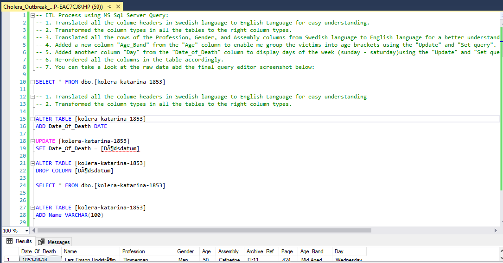
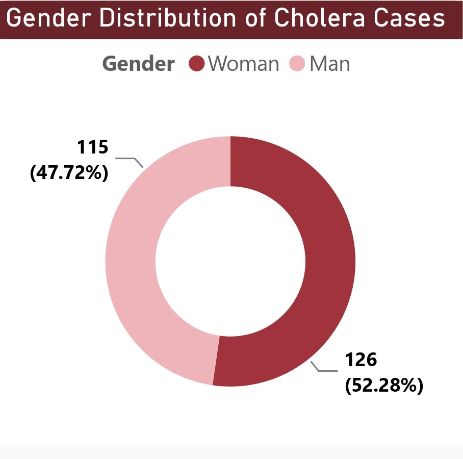
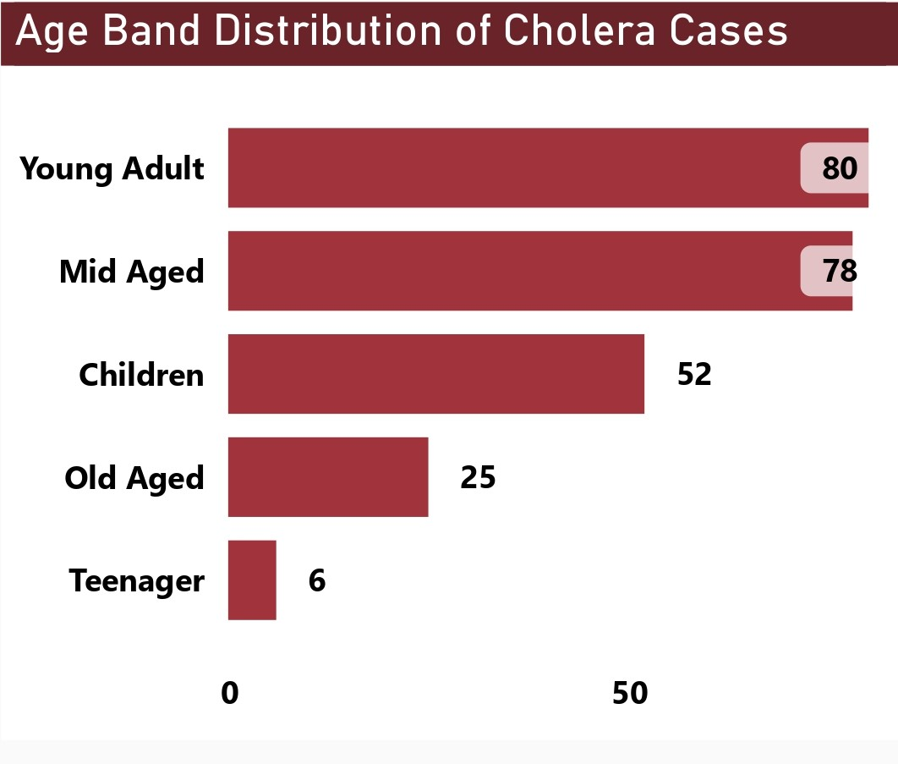
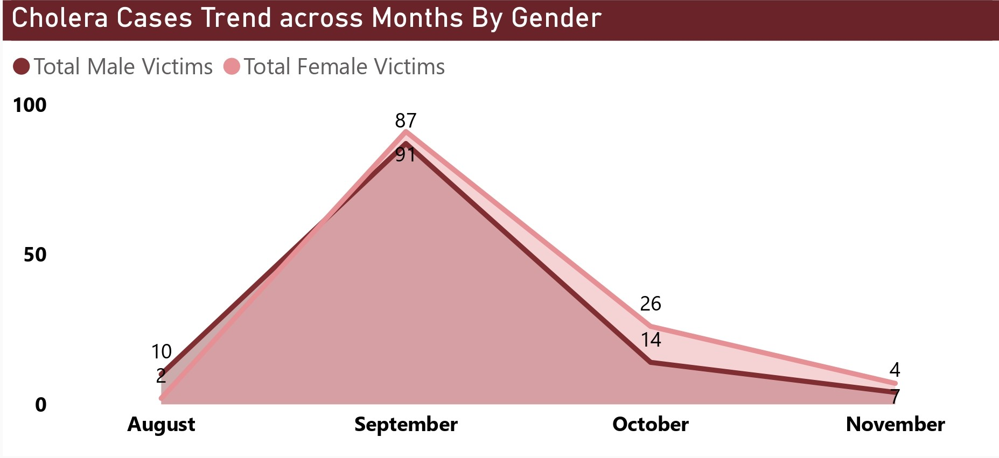
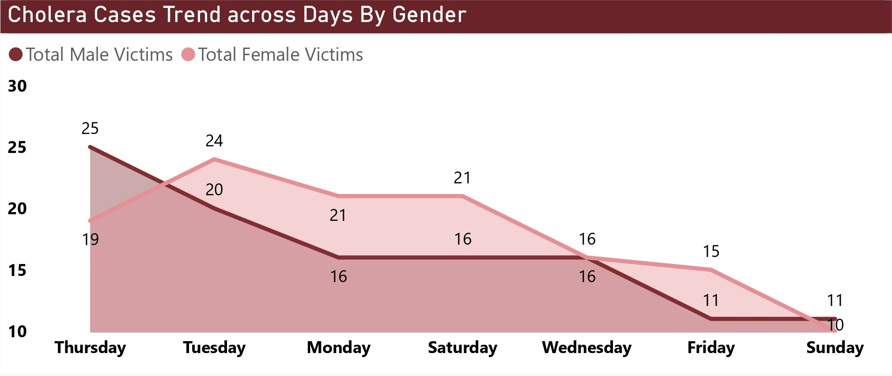

# Cholera Outbreak, Stockholm (1853) Analysis

 

## Table of Contents
- [Project Overview](#project-overview)
- [About The Dataset](#about-the-dataset)
- [Tools Used](#tools-used)
- [Visuals in Power BI:](#visuals-in-power-bi)
- [Interact With Power BI Dashboard Report](#interact-with-power-bi-dashboard-report)
- [Conclusion](#conclusion)
 

## Project Overview
### Introduction:
The cholera epidemic in 1853 known as the Kolera Katerina in Stockholm, Sweden became such a historical event when the two biggest social trends that characterized the modern world at the middle of the nineteenth century, the growth of cities and the crisis of health, prepare the field to demonstrate the vulnerability of a growing capital. The outbreak which was first observed in the district of Katarina expended very quickly in the area and demonstrated very dismal outcomes and deficiencies in sanitation and health care systems.

It relates to the study of the historical background of Stockholm from the nineteenth century as part of research. Thus, since Sweden has well-preserved church records providing access to detailed information about, for instance, pandemic occurrences due to the availability of preserved church records, this research became possible. The subject matter for data collection in this case was the large cholera outbreak that began in late August 1853 to the month of November in the same year. Approximately three percent of the population would be dead within two weeks of the infection. For instance, poor parts of the city, like S:Investment houses such as t Catherine parish were severely affected. The project shall therein endeavour to reveal some basic facts about the infamous 1853 outbreak, and more specifically about the victims’ demographic characteristics and the number of cases reported in the period.

### Problem Statement
The data analysis is supposed to explore the distribution of the Cholera Outbreak in Stockholm in 1883, as well as overall demographic trends, in order to determine the key factors that contributed to the epidemiological processes and outcomes. Specifically, the study seeks to address the following research questions:Specifically, the study seeks to address the following research questions:
- From the available data, one may be asking how many cases were recorded in the period under analysis.
- Who are victims? What is the average age of victims?
- Lesser known is the fact that 13 men and boys were killed in the process, and to some extent what this reveals about the organization’s gender arrest dynamics.
- The overall count of the number of women affected by the violence is?
- I am particularly concerned with the number of cases of Cholera by the gender of the patients, by month.
- How does it fare, the trend of Cholera cases by gender on a daily basis?

### Expected Finding:
- However, in relation to the outlined problem statement regarding the cholera outbreak of 1853 in Stockholm several important findings are expected. First, the project seeks to identify the total number of cases recorded in the selected period of analysis to gain a true extent of the outbreak and its effects on the populace.

- Secondly, the study endeavours to establish the mortality rate of cholera patients in this period during the epidemic to identify the age demographic of the most affected vulnerable group.

- Moreover, the field work also aims at developing the probative data of the total number of male and female separately in order to better determine whether gender has the tendency to predispose one to the deadly disease of cholera to create a better intervention schedule.

- Also, the trend of the cholera cases by gender in terms of both monthly and daily will be determined in order to understand the changes in the rate of infection of the disease among the male and female during the period under analysis.

Through the synthesis of these anticipated findings the project would add value in understanding the epidemiological trends of the Kolera Katerina outbreak so that there can be better formulation of decisions and policies concerning similar historic public health emergencies.
 
 

### About The Dataset
The data is collected from hand-written church records. The church was responsible for all population registration until around 1870. Only death records have been analyzed. Since Cholera has around 40% CFR we can assume a larger number of affected but surviving individuals.

All data can be found at the National Archive of Sweden. See [here](https://sok.riksarkivet.se/digitala-forskarsalen) (press "Other languages" for an English version). Another important source for further analysis is "Sundhets-collegii underdåniga berättele om 
Kolerafarsoten i Sverge, 1853" which is a broad overview of the epidemic situation in all of Sweden. This contemporary report can be found at Statistics Sweden (SCB): See [link](https://share.scb.se/ov9993/data/historisk%20statistik/Officiell%20statistik%201811-1860%2FHälso-%20och%20sjukvården1851-1860%2FSundhetskollegii-underdaniga-berattelse-om-Medicinalverket-i-riket-1853-Bihang.pdf). The data is in a .csv file format and you can view the dataset [here](kolera-katarina-1853.csv). 

The dataset contains 8 fields (translated to English Language) and 249 rows of data. Below is a data dictionary of this dataset:

| Table                              | Field                    | Description                            |            
|:-----------------------------------|:------------------------ |:-------------------------------------- |
|Kolera-Katarina-1853.csv            | Date_of_Birth            | This column, therefore, holds the date of birth to the people impacted on by the cholera outbreak. It presents data on the age of the people and this is an important factor that forms the basis of demographic studies.    |
|                                    | Name                     | This column has the names of the affected persons with cholera. They can track instances of implementation at the individual level allowing for following up on the particular cases.     |
|                                    | Profession               | This column captures the profession or occupation of the affected persons in the cholera incident. Vaccination also helps in the offering of information regarding the population affected as well as the social and economic factors associated with them.         |
|                                    | Gender                   | This column would represent the sex of the people that got affected by this cholera outbreak. It makes it possible to compare genders concerning the question and the outbreak notifying on the differences or inequality in the vulnerability to such diseases or outcomes of the infected ones.         |
|                                    | Age                      | This column holds the age of the cholera afflicted people. It delivers a quantitative analysis of the age distribution of the cases that is vital in the study of the incidence of diseases.        |
|                                    | Assembly                 | This column indicates the jurisdictional or managerial unit that the mentioned people pertain to. It assists in sorting the data according to the geographical area that may be important when analyzing the data in order to find out if cases are concentrated in certain areas.        |
|                                    | Archive_Ref              | This column shows links to the available source of the archival materials/documents that can be associated with the cholera outbreak. It creates awareness to the sources of the data so that the reader can verify the information given in the analysis.       |
|                                    | Page                     | This column indicates the page number/s where in the particular archival documents/source, information pertaining to the cholera outbreak is found in. It aids in searching for and identifying certain record or data points within the source documents.         |
 

### Skills Utilized
1. Data Cleaning
2. Data Visualiziation
3. Descriptive Analytics
4. Critical Thinking and Problem Solving
5. Communication and Reporting
 

### Tools Used
1. MS Sql Server
    - Was used to:
        1. Clean
        2. Transform the dataset for this analysis.
           
2. Power BI (Was used to create reports and dashboard for this analysis)
    - The following Power BI Features were incorporated:
        1. DAX,
        2. Quick Measures,
        3. Filters,
        4. Tooltips
 

### Data Cleaning, Transformation and Loading using the MS Sql Server:
1. Made sure that all the data types of the tables in this dataset are of the right data type.
2. Translated all the colume headers in __Swedish language__ to __English Language__ for better understanding.
3. Translated all the rows of the __"Profession"__, __"Gender"__, and __"Assembly"__ columns from __Swedish language__ to __English language__ for a better understanding of the table data.
4. Added a new column __"Age_Band"__ from the __"Age"__ column to enable me group the victims into age brackets using the _"Update"_ and _"Set query"_.
5. Added another column __"Day"__ from the __"Date_of_Death"__ column to display days of the week (sunday - saturday)using the _"Update"_ and _"Set query"_.
6. Re-ordered all the columns in the table accordingly.

- You can take a look at the raw data and the sql query screenshot below:
 

Raw Data Screencshot                                                               |                       
:---------------------------------------------------------------------------------:|

You can preview the raw data file [here](kolera-katarina-1853.csv)
 

Sql Query Screenshot                                                               |                       
:---------------------------------------------------------------------------------:|

You can preview the MS Sql Server query file [here](Cholera_Outbreak_Stockholm_1853_Project.sql)
 
 

## Data Modelling
No modelling was required since we had just one table for this analysis.
 
 

## Visuals in Power BI:

 
 

#### Project Analysis:
From the analysis, our problem statement can be given answers to as analyzed below:
- The total number of cases within the analysis period was __248.__
- The average age of the victims was __34.__
- The total number of male victims within this analysis period was __118.__
- While the total number of female victims was __130.__
 
 

- 

- **Age Distribution of Cholera Cases:**
- Age distribution of victims: From this, we could deduce that infants who were a year old or below were more susceptible to the cholera epidemic and therefore had the highest cases of the cholera epidemic at about 13 infants, with other infants within the age of 2 to 4 having the large number of 23 together. The second group of people with the most number of cases were young adults, immediately after the children. There were 10 victims aged 33; 7 aged 34 years while 8 were aged 37 years. The ages that fell victims to this outbreak the most were those aged between 20 - 39 years. The classification continues with high figures from those within the 40-60-year-old age bracket, followed by the old aged, and lastly by the teenagers.
 
 

- 

- **Gender Distribution of Cholera Cases:**
- Wherein in our analysis, the female gender dwindled more in this period of analysis compared to the male gender, it resulted in 126 victims sharing 52.28 percent of the count. The males have counted 115 victims sharing 47.72 percent of the count. Hence, we would like to ask, why did we record more deaths of the females than the males? Is there a reason for that? From our analysis, the reasons may be attributed to the factors stated below:

   1. Women, in many societies at that time, played different roles and thus led lives that differed from men in a number of ways. For instance, they were more involved in caring and household activities, which may have increased their exposure to contaminated water- or food-borne sources, leading to a higher risk of cholera.

   2. Access to healthcare differed between the two sexes. Quite probably, social norms or economic constraints limited the females' access to medical treatment, thus entailing delays or poor health care in case of cholera symptoms.

   3. The other reasons may be biological gender-specific differences. This means that hormones or other genetic predispositions could have been influenced susceptibility to cholera or the severity of its symptoms.

   4. In the event that there were certain occupations which were peculiarly held by women during that time period in Stockholm, such as domestic work or certain kinds of factory labor, they likely would have had increased exposure to contaminated environments and thus potentially higher rates of infection.

   5. The difference in hygiene behavior of both sexes, should any exist, may explain differences in cholera transmission. For example, if women were responsible for food preparation or childcare, they may have been more likely to come into contact with contaminated surfaces or objects.

   6. Cultural norms and expectations, such as acting modest or deferring to male authority figures, may have been a steady determinant for a woman seeking timely medical care or adhering to preventive measures against cholera.
 
 

- 

- **Age Band Distribution of Cholera Cases:**
- From the Age Band distribution, it could be seen that the Young Adults (20 - 39 years) had the highest number of cholera cases at 80, and the Mid Aged (40 - 60 years) followed with 78 cases. Next in line were the Children, less than 1 - 12yrs, with 52, the Old Aged, 60+ yrs, with 25, and lastly, the teenagers, 13 - 19yrs, categories with 6 cases. We can go further and analyze the case toll in this age band and what could be the influence of the numbers among the different age bands. I was able to deduce from further analysis the following points: 

    1. __Young Adults (20 – 39yrs):__ The high number of cases in this age group may be a result of very many factors, which could be increased mobility, social interaction, and exposure to contaminated environments. Young adults may be more likely to have engaged in risky activities for transmission of cholera, for example, working in crowded spots in urban areas or living in heavily populated neighborhoods with poor infrastructure or sanitation.

    2. __Mid-Aged 40 - 60yrs:__ The people in this group could, like the young adults, have had exposure to cholera through occupational activities or household responsibilities. additionally, the mid-aged category may have had difficulties in visiting health centres and adhering to preventive measures since they are forced by family or work-related responsibilities.

    3. __Children (less than 1 - 12yrs):__ Children are, more often than not, more susceptible to infections due to their immature immune systems and a higher tendency of being in settings where infection exposure is high, for example, schools or day-care centers. Poor hygiene practices, inadequate sanitation facilities and limited access to clean water might have contributed to the relatively high number of cholera cases among children.

    4. __Old Aged 60+yrs:__ Older adults might have been exposed to an increased risk from complications of cholera due to age-related decline in their immune systems. This would be attributed to factors such as reduced levels of functioning and a higher prevalence of underlying health conditions. Reduced mobility, social isolation, or difficulties in accessing health care services could also have aggravated the vulnerability of the age group to cholera infection.
 
    5. __Teenagers (13 - 19yrs):__ The low number of cases among teenagers can be attributed to variables such as healthier immune systems. It is, therefore, likely that this age group retained a better system of maintaining hygiene and avoiding contaminated settings in the slum environment. Cholera incidence among teenagers would, therefore, be expected to differ due to differences in socioeconomics.
 
 

- 

- **Cholera Cases Trend Across Months by Gender:**
- September had the highest number of cases trending by gender and month with 178 cases of which 91 were females and 87 were males. The month of October recorded 40 cases, 26 of which were females, while 14 were males. 10 female cases were recorded in the month of August and males were 2, totaling 12 cases. In November, there were 7 female cases and 4 male cases, totaling them to 11 cases. We can further as part of our analysis investigate this trend to come up with more insight into factors that would have influenced these large figures within the months that have been stipulated:

    1. __September :__ September had the highest number of cases at 91 females and 87 males. 
This might be attributed to several factors, either environmental conditions that enhance the transmission of cholera through temperature or a rise in rainfall, hence bacteria growth in water sources. Concurrently, socio-economic factors such as overcrowding, and bad sanitation infrastructure, among others, contributed to this high rate of transmission.

    2. __October:__ Although fewer cases occurred in October as compared to the number in September, a fair share of the cases still occurred, affecting 26 females and 14 males. Factors that could have influenced the continuation of the outbreak into October may be delayed public health response or sustained contamination of water sources; and challenges in safely accessing clean water and sanitation facilities in affected communities.

    3. __August and November:__ Although fewer cases were reported in August and November compared to September and October, they still contributed to the impact of the epidemic. This contributed to the generally high burden of the outbreak. The August cases could point out the first stage of the outbreak, and those in November refer to continued transmission or localized outbreaks. Other ingredients like population movements, migration patterns, or changes in weather conditions may have influenced the distribution of cases during these months.
 
 

- 

- **Cholera Cases Trend Across Days by Gender:**
- From the trend of Cholera cases across days of the week by gender during the period under this analysis, our insight indicates that Thursdays registered the highest number at 44, with females being 25 and males being 19. This is followed by Tuesdays, which recorded 24 females and 20 males to make them 44. Mondays and Saturdays recorded similar figures: 21 females and 16 males respectively to the total of 37 apiece. Fridays followed next with a total of 26 cases: 15 from the female folks, while 11 were from the male folks. Sundays witnessed a total of 21 cases, 10 females and 11 males respectively. We may also want to know what influences these great numbers of cholera cases on these different days of the week. Further analysis has raised some insights:

    1. __Thursdays:__ Various factors may account for the high number of cases on Thursdays, such as increased social activities or gatherings that involve contaminated food or water sources. Then again, food preparation practices, bead-like sanitation conditions, or even disruptions in water supply may play a role in increased transmission on Thursdays.

    2. __Tuesdays:__ On Tuesdays, the number of cases was more or less the same as on Thursdays, which may point to some similar behavioral or environmental factor that influences cholera transmission. In this case, there could be a higher degree of mobility or activities related to commerce, like market days or the transporting of goods.

    3. __Mondays and Saturdays:__ The occurrence of similar numbers of cases on Mondays and Saturdays indicates that some routine activities or environmental conditions play a role in cholera transmission on these days. Some of the factors that may have an influence on case distribution on these days, that is, Mondays and Saturdays, include; communal gatherings, religious ceremonies, and fluctuations in water supply and sanitation services.

    4. __Fridays and Sundays:__ Fridays recorded a slightly higher case count compared to Sundays, but both days were relatively fewer in cases compared to Thursdays and Tuesdays. These may have been facilitated by decreased business activities, altered social conduct, or improved access to health services on Fridays and Sundays.
 
 

## Interact With Power BI Dashboard Report
You can view and interact with this report [here](https://app.powerbi.com/view?r=eyJrIjoiNjkxZmMxMDYtMWMyYS00Yjc3LTlkYjItNDgzNjBhM2Q3ZjU5IiwidCI6IjdlYzI5NjU5LTNjZjItNGYzZi1hYmIzLWE3MjJlZGY3ZmYyZCJ9).The dashboard report on Cholera Outbreak, Stockholm, 1883 Analysis displays an interactive visual of the project in power BI.
 
 
 
 

## Conclusion
- The three important factors in the spread of cholera, which were well captured by the 1883 Stockholm cholera outbreak, are sanitation, education, and collaboration. Knowing the different patterns in outbreaks like this would mean we understand how to improve defenses against future outbreaks. In this regard, improving hygiene standards, educating the public, and working together will lower the potential for an outbreak of a cholera-like disease to affect a community.

- Looking at this analysis, we also see the need to mitigate the spread of illnesses as seen in the Stockholm cholera outbreak. Outbreaks can be stopped by keeping things and environments clean, teaching people how to be and live healthy, and working together with others to prevent outbreaks. We should remember that simple acts of proffering solutions could enormously influence the emergence of safe and healthy communities.
 
 

## Thank You For Following Through!
