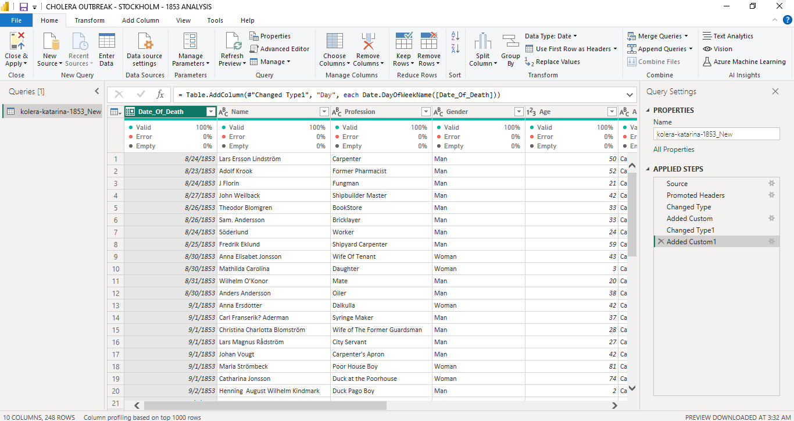
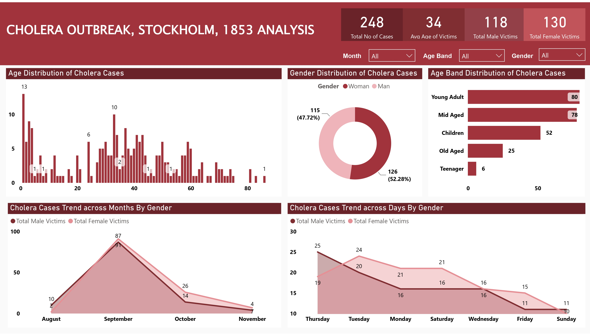

# Cholera-Outbreak-Stockholm-1853-Analysis

## Project Overview
### Introduction:
The cholera outbreak of 1853 in Stockholm, Sweden, colloquially known as "Kolera Katerina," represents a crucial moment in the city's history, where the convergence of urbanization and public health crises laid bare the vulnerabilities of a rapidly expanding metropolis. Originating in the Katarina neighborhood, the outbreak swiftly swept through the city, leaving devastation in its wake and exposing systemic shortcomings in sanitation infrastructure and healthcare provision.

This is part of research work on the history of Stockholm in the 19th century. Since Sweden has well-preserved church archives this permits getting detailed information about e.g. pandemic events. In this data collection, Information was gathered about the large cholera outbreak in late August 1853 to the month of November, 1853. About 3% of the population died within a couple of weeks. Poor parts of the city, such as S:t Catherine parish was hit very hard. This project endeavors to illuminate some key information of the 1853 outbreak, delving into the demography of the victims and the cases trend by within the period.

### Problem Statement
- What is the total number of cases within the scope of the period of this analysis?
- What is the average age of victims?
- What is the total number of male victims?
- What is the total number of female victims?
- What is the cholera cases trend by gender monthly?
- What is the cholera cases trend by gender daily?

### Expected Finding:
- In addressing the outlined problem statement concerning the cholera outbreak of 1853 in Stockholm, several key findings are anticipated. Firstly, the project aims to ascertain the total number of reported cases within the specified period of analysis, offering a comprehensive understanding of the outbreak's scale and impact on the population.

- Secondly, the investigation seeks to determine the average age of cholera victims within this period during the outbreak, providing insights into the demographic profile of those most affected by the disease.

- Additionally, the project endeavors to quantify the total number of male and female victims separately, shedding light on potential gender disparities in susceptibility to cholera and informing targeted interventions.

- Moreover, the analysis will elucidate the cholera cases trend by gender on both a monthly and daily basis within the period, enabling the identification of temporal patterns and variations in infection rates among males and females throughout the course of the outbreak.

By synthesizing these expected findings, the project aims to contribute valuable insights into the epidemiological dynamics of the Kolera Katerina outbreak, facilitating informed decision-making and enhancing our understanding of historical public health crises.

### Tools Used
1. Power Query Editor
    - Was used to:
        1. Extract,
        2. Transform, and
        3. Load all the datasets for this analysis.
           
2. Power BI (Was used to create reports and dashboard for this analysis)
    - The following Power BI Features were incorporated:
        1. DAX,
        2. Quick Measures,
        3. Page Navigation,
        4. Filters,
        5. Tooltips

### ETL Process using the Power Query Editor:
1. Ttranslated all the colume headers in Swedish language to English for easy understanding
2. Translated all the rows of the Profession, Gender, and Assembly from Swesih language to English for a better understanding of the table data.
3. Transformed the column types in all the tables to the right column types.
4. Added a new column "Age_Band" from the "Age" column to enable me group the victims into age brackets using the "If Statement".
5. Changed the "Date_of_Death" column type to "date".
6. Added another column "Day" from the "Date_of_Death" column to display days of the week (sunday - saturday).
6. Re-ordered all the columns in the **flights** table accordingly.
7. You can take a look of our final query editor screenshot below:
   

## Visuals in Power BI:

#### Analysis:
From the analysis, our problem statement can be given answers to as seen below in this analysis:
- The total number of cases within the analysis period is 248.
- The average age of victims is 34.
- The total number of male victims within this analysis period is 118
- While the total number of female victims is 130.
- Looking at the age distribution of victims, we could see that infants who were a year and below fell the highest victim to the cholera epidemic with about 13 infants, with other infants within the age of 2 to 4 having a large number of 23. Young adults are the second group of people that had the highest number of victims after the children. Those aged 33 withnessed 10 cases, those 34yrs had 7 cases, , those 37 had 8 cases. Those within the age of 20 - 39 fell victims to this outbreak the most. Those within the age of 40 - 60 follows also with a high figure, the least of them were the old aged.
- From our analysis, the female gender had more casualties within this period of analysis than the male gender with 126 victins with a 52.28% share of the victims while the males had 115 victims with a 47.72% share. We may ask, why did we record more deaths of the females than the males? This can be attributed to the below factors:
       - In many societies during that era, women often had different roles and behaviors compared to men. For instance, they might have 
         been more involved in caregiving or household activities, which could have increased their exposure to contaminated water or 
         food sources, thereby raising their risk of contracting cholera.

       - Women might have had different access to healthcare compared to men. It's possible that societal norms or economic constraints 
         limited women's access to medical treatment, resulting in delayed or inadequate care for cholera symptoms.

       - Biological differences between genders could also play a role. Hormonal factors or genetic predispositions might have influenced 
         susceptibility to cholera or the severity of the disease's symptoms.

       - If certain occupations were predominantly held by women in Stockholm during that period, such as domestic work or certain types 
         of factory labor, they might have faced increased exposure to contaminated environments, contributing to higher infection rates.

       - Differences in hygiene practices between genders could have affected cholera transmission rates. For example, if women were 
         responsible for food preparation or childcare, they might have been more likely to come into contact with contaminated surfaces 
         or objects.

       - Cultural norms and expectations regarding behavior, such as modesty or deference to male authority figures, might have 
         influenced women's ability to seek timely medical care or adopt preventive measures against cholera.

- From the Age Band distribution, we can could see that Young Adults (20 - 39yrs) had the highest number of cholera cases of 80, while the Mid Aged (40 - 60yrs) follows witb 78 cases. The Children (less than 1 - 12yrs) follows with 52 cases, the Old Aged (60+yrs) with 25, and lastly, the Teenagers (13 - 19yrs) with 6 cases. We may also go further to analyze this age band case tolls and what could have influenced the numbers:
       - Young Adults (20 - 39yrs): The high number of cases in this age group could be attributed to factors such as increased 
         mobility, social interaction, and exposure to contaminated environments. Young adults may have been more likely to engage in 
         activities that put them at risk of cholera transmission, such as working in crowded urban areas or living in densely populated 
         neighborhoods with inadequate sanitation infrastructure.

       - Mid Aged (40 - 60yrs): Similar to young adults, individuals in this age group may have been exposed to cholera through 
         occupational activities or household responsibilities. Additionally, mid-aged individuals might have faced challenges in 
         accessing healthcare or adhering to preventive measures due to family obligations or work commitments.

       - Children (less than 1 - 12yrs): Children are often more vulnerable to infectious diseases due to their developing immune 
         systems and higher likelihood of exposure in communal settings such as schools or daycare centers. Poor hygiene practices, 
         inadequate sanitation facilities, and limited access to clean water could have contributed to the relatively high number of 
         cholera cases among children.

       - Old Aged (60+yrs): Older adults may have been at increased risk of cholera complications due to age-related decline in immune 
         function and higher prevalence of underlying health conditions. Limited mobility, social isolation, and challenges in accessing 
         healthcare services could have further exacerbated their vulnerability to cholera infection.

       - Teenagers (13 - 19yrs): The low number of cases among teenagers could be attributed to factors such as healthier immune 
         systems, adherence to hygiene practices, and potentially lower exposure to contaminated environments compared to other age 
         groups. However, socio-economic factors, including access to clean water and sanitation facilities, may have also played a role 
         in shaping the incidence of cholera among teenagers.

